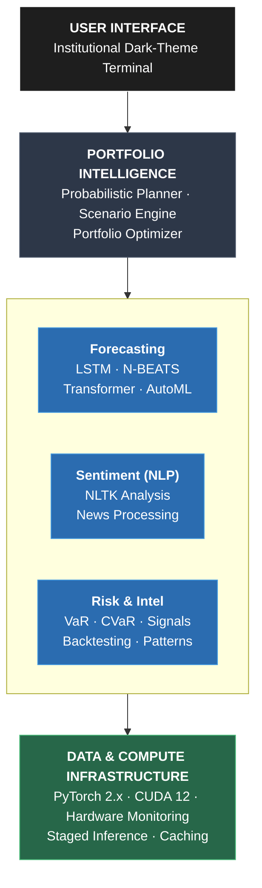

<div align="center">
  <h1>TradeVision</h1>
  <p><b>Institutional AI Financial Intelligence Platform</b></p>
</div>

---

## 📖 Table of Contents
- [Platform Overview](#-platform-overview)
- [Core Architecture](#-core-architecture)
- [AI Forecasting & NLP Infrastructure](#-ai-forecasting--nlp-infrastructure)
- [Quantitative Finance Systems](#-quantitative-finance-systems)
- [Risk & Market Intelligence](#-risk--market-intelligence)
- [Installation & Setup](#-installation--setup)
- [Project Structure](#-project-structure)
- [Disclaimer](#-disclaimer)

---

## 🏛 Platform Overview

**TradeVision** is a production‑grade probabilistic quantitative analytics platform engineered for institutional investors, quantitative researchers, and portfolio managers. It unifies deep‑learning forecasting, Natural Language Processing (NLP), rigorous risk quantification, and portfolio intelligence in a single terminal—transforming raw AI predictions into institutionally sound, decision‑ready intelligence.

TradeVision surfaces forecast distributions, scenario probabilities, and feasibility scores. All projections are **uncertainty‑aware**, **calibrated**, and **subject to financial realism constraints**—including volatility drag, alpha decay, and Bayesian shrinkage.

---

## ⚙️ Core Architecture



---

## 🧠 AI Forecasting & NLP Infrastructure

TradeVision’s backbone consists of specialized deep‑learning architectures and NLP pipelines, each trained under a unified probabilistic regime.

### Core Models
* **N-BEATS:** High-capacity interpretable trend/seasonality decomposition *(See `NBEATS_INTEGRATION.md`)*.
* **Transformer & TCN:** Multi-scale temporal relationships and efficient parallel training for large horizons.
* **LSTM & Attention-LSTM:** Robust sequential pattern extraction and trend inflection detection.
* **Ensemble:** Weighted dynamic blend for consistency across all market conditions.

### NLP & Sentiment Engine
* **NLTK Processing (`NLTK.py`):** Real-time sentiment analysis of financial news and text data to gauge market psychology and institutional sentiment.

### Probabilistic Forecasting
* **Confidence Intervals & Calibration:** Quantile regression and conformal prediction.
* **AutoML:** Automated hyper‑parameter search with validation‑loss‑driven early stopping.

*(For deep dives into model architecture, see `MODEL_IMPLEMENTATIONS.md`)*

---

## 📈 Quantitative Finance Systems

Beyond forecasting, TradeVision embeds a full quantitative engine that translates probability distributions into portfolio decisions.

* **Probabilistic Investment Planner:** Monte Carlo Scenarios with correlated returns and required alpha modeling.
* **Portfolio Optimization:** Mean‑variance, risk‑parity, and minimum‑CVaR optimizers with diversification scoring (Effective‑N, HHI).
* **Financial Realism Layer:** Volatility Drag (Compounded return adjusted by ½σ²) and Alpha Bounding to cap empirically plausible returns.

---

## 🛡️ Risk & Market Intelligence

### Risk Analytics
* **VaR & CVaR:** 95% and 99% confidence (Historical & Parametric) + Expected Shortfall.
* **Max Drawdown:** Peak‑to‑trough loss with duration analysis.
* **Ratios:** Sharpe, Sortino, and Calmar ratios.

### Market Intelligence
* **Real‑Time Monitor:** Live quotes, period‑adjustable charts, statistics grid.
* **Trading Signals:** Multi‑indicator aggregation (RSI, MACD, Bollinger Bands, MA crossovers).
* **Backtesting Engine:** Strategy templates, equity‑curve visualization, profit factor analysis.

---

## 🚀 Installation & Setup

### Prerequisites
* Python 3.10+
* NVIDIA GPU with ≥6 GB VRAM (RTX 3060+)
* CUDA 12.x toolkit
* Git

### Quick Start

# Installation Guide

## 1. Clone the Repository

```bash
git clone https://github.com/aaron-exe/tradevision.git

cd tradevision
```

## 2. Create and Activate Conda Environment

```bash
conda create -n tradevision python=3.10 -y

conda activate tradevision
```

## 3. Install Core Dependencies

```bash
conda install numpy=1.26 pandas scipy -y

conda install scikit-learn=1.3.2 -c conda-forge -y
```

## 4. Install PyTorch (CPU Version)

```bash
conda install pytorch torchvision torchaudio cpuonly -c pytorch -y
```

> If you want GPU support, install the CUDA-enabled version of PyTorch from the official PyTorch website.

## 5. Install Remaining Python Packages

```bash
pip install streamlit plotly yfinance nltk requests chardet
```

## 6. Install Visualization Libraries

```bash
conda install matplotlib seaborn xlsxwriter -y
```

## 7. Download NLTK Resources

```bash
python -c "import nltk; nltk.download('punkt'); nltk.download('brown')"
```

## 8. Remove Old Model Files (Optional)

### Windows

```bash
del models\*.pkl
```

### Linux / macOS

```bash
rm models/*.pkl
```

## 9. Run the Application

```bash
streamlit run app.py
```

## Verified Working Environment

- Python 3.10
- NumPy 1.26
- Scikit-learn 1.3.2
- PyTorch CPU Version
- Streamlit

*(For a more detailed setup guide, check `QUICK_START.md`)*

---

## 📂 Project Structure

<details>
<summary><b>Click to expand the directory tree</b></summary>
<br>
<pre><code>.
├── .devcontainer/            # Dev container configurations
├── data/                     # Cached market data and datasets
├── models/                   # Serialized model weights
├── notebooks/                # Exploratory research and Jupyter notebooks
├── src/                      # Core platform source code
├── GPU.py                    # Advanced GPU utilization and tracking
├── NLTK.py                   # Natural Language Processing & Sentiment pipeline
├── app.py                    # Main terminal UI (Streamlit)
├── check_gpu.py              # Hardware validation and CUDA checks
├── config.py                 # Global platform configuration
├── environment.yml           # Conda environment definition
├── requirements.txt          # Python dependencies
├── MODEL_IMPLEMENTATIONS.md  # Deep learning architecture docs
├── NBEATS_INTEGRATION.md     # N-BEATS model documentation
├── SYSTEM_WORKFLOW.md        # Data pipeline and workflow docs
├── QUICK_START.md            # Extended startup guide
└── NEW_FEATURES.md           # Changelog and upcoming features</code></pre>

</details>

---

## ⚠️ Disclaimer

**TradeVision is an institutional‑grade analytical tool for educational and research purposes only.** It does **not** constitute financial, investment, or trading advice. All forecasts are probabilistic and inherently uncertain. Past performance is not indicative of future results. Investment decisions involve risk, including potential loss of principal. Users must conduct independent due diligence and, where appropriate, consult a qualified financial advisor. The developers assume no liability for any financial losses, direct or indirect, arising from the use of this software.

**Use of this platform is entirely at your own risk.**

---

<div align="center">
  <p>Distributed under the <b>MIT License</b>. See <code>LICENSE</code> for more information.</p>
  <p><sub>Built for the institutional frontier — where AI meets real‑world finance.</sub></p>
</div>
